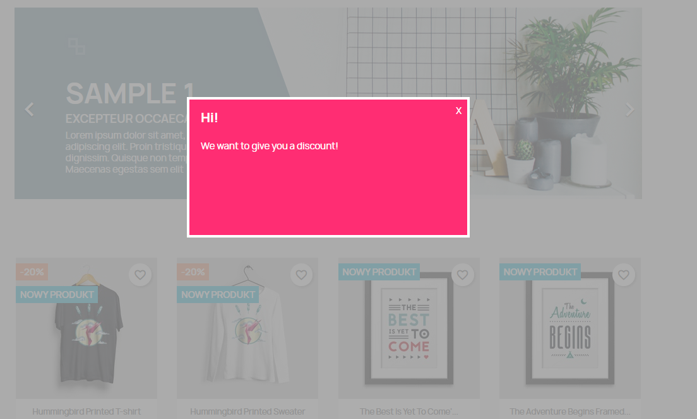
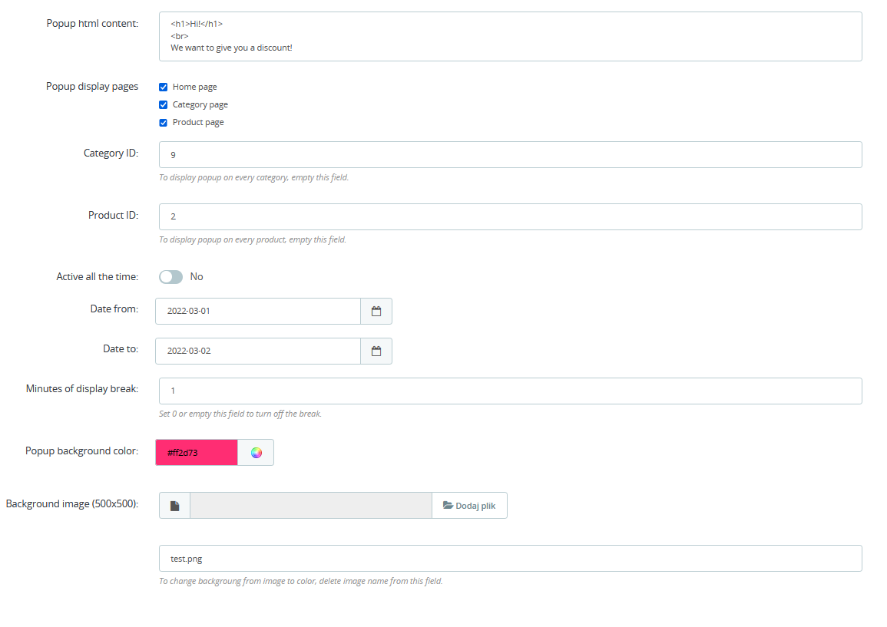

# focustracker

This is a module for prestashop. It is displaying pop-up on the client area page whenever clients moves his cursor out of page.

## Configuration

In configuration page, you can configure:
-   Popup content
-   Pages where popup will be displayed:
    -   Home page
    -   Category page
    -   Product page
-   Id of category where popup will be displayed
-   Id of product where popup will be displayed
-   Set date frames, when popup will be displayed
-   Set break time between popup displays
-   Popup background
    -   color
    -   image
    

